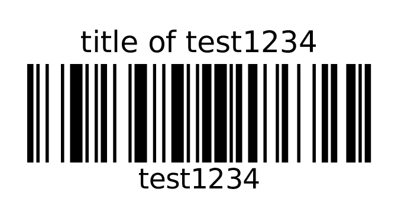
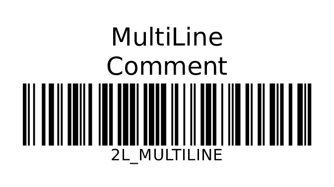

# glabels-3 templates

## TL;DR-
 Generate barcode labels comfortably with provided here Makefile build script and set of [glabels] templates!

To see examples just type : `$ make` 

Even automatically from Google spreadsheets!

Scipts allow generating of labels as trivial as prefix your [csv] with `TempalteNameMyCSV.csv` and then run `make TemplateNameMyCSV.pdf` to make pdf out of it.

## Requirements

### [glabels] to be compiled with 

* for [code 128] templates require [glabels-3] to be compiled with [Zint library][libzint] (if one in your default distribution package is not compiled with it, don't worry, installing [libzint] and compiling [glabels-3] goes smoothly)

<!--
* for [QR code] templates may require [QREncode] 
* for some other may require [GNU Barcode] to be compiled with.
-->

### [Make]

[Make] is default on unix platforms. It may require install on other's like systems. On non-rooted Android, I have most successes with [Termux]. For Windows there are also packages with make.

### About templates

* use `code` column for barcode,
* and `title` column for description of label.
* filenames are tend to be self descriptive
* and measurement unit if millimeter if omitted.

## Example usage

Makefile is constructed in a way to match your filename with desired template.
For example, in order to print:

* [code 128] 57x32 mm label
* with enough place for two lines of "title" description text

### Do following:

* locate template, that looks desirable : here it will be `code128title2L57x32.glabels` - following parts of filename mean:
    * `code128title` stands for barcode with "code" encoded as [barcode 128] with `title` description
    * `2L` with enough place to fit two lines of text of description
    * `57x32` - 57mm width, 32mm height
* Name `code` and `title` appropriate columns in your [csv] file
* prefix your [csv] file with basename of template : `$ mv t.csv code128title2L57x32-MyCSV.csv`
* execute to make pdf out of it: `$ make code128title2L57x32-MyCSV.pdf`

### How to fetch from your Google Spredsheet to csv?

Select 

* File->Publish to The Web
* Use "Link" tab
* Change "Entire Document" to desired sheet
* Change "Web page" to "CSV"
* grab url link to your export
* use command: `$ curl -o MyCSV.csv http://your_url_link`

Please note that after this operation sheet will be publicly available under specified link.

To preserve limited access controls, make it more manually

* File-> Download As -> Comma, separated values (.csv)

You can similarily download `.csv` data from many other places , like your [Airtable](https://airtable.com) tables !

## Templates

Currently I [publish here Airtable base](https://airtable.com/shrr8sIa3cMKpO4b9/tblYrrV3xMs7DL4kO/viwVBwkYcI0a9uCwl) consisting `glabels-3-templates` table - [here is Gallery view of `glabels-3-templates` table with previews](https://airtable.com/shrnM0shPlthoFrZo).

Less updates copy (thanks [csv2md online converter][csv2md] !):

| glabels template                 | width | height | type of stickers originally used | lines of title | orientation | prefix for csv filenames using this template | barcode_type       | Rendered Example                                                                                               |
|----------------------------------|-------|--------|----------------------------------|----------------|-------------|----------------------------------------------|--------------------|----------------------------------------------------------------------------------------------------------------|
| code128title57x32.glabels        | 57mm  | 32mm   | Dymo_S0722540_11354              | 1L             | Portrait    | code128title57x32                            | Code128            |   |     |
| code128title2L57x32.glabels      | 57mm  | 32mm   | Dymo_S0722540_11354              | 2L             | Portrait    | code128title2L57x32                          | Code128            |   |
| I2of5title57x32CablesL.glabels   | 57mm  | 32mm   | Dymo_S0722540_11354              | 1L             | Landscape   | I2of5title57x32Cables                        | Interleaved 2 of 5 |                                                                                                                |
| I2of5title57x32CablesP.glabels   | 57mm  | 32mm   | Dymo_S0722540_11354              | 1L             | Portrait    | I2of5title57x32Cables                        | Interleaved 2 of 5 |                                                                                                                |
| code128title57x32CablesL.glabels | 57mm  | 32mm   | Dymo_S0722540_11354              | 1L             | Landscape   | code128title57x32Cables                      | Code128            |                                                                                                                |
| code128title57x32CablesP.glabels | 57mm  | 32mm   | Dymo_S0722540_11354              | 1L             | Portrait    | code128title57x32Cables                      | Code128            |                                                                                                                |

[glabels]: https://github.com/jimevins/glabels
[glabels-3]: https://github.com/jimevins/glabels
[libzint]: http://www.zint.org.uk/
[csv2md]: https://github.com/donatj/CsvToMarkdownTable
[QREncode]: http://megaui.net/fukuchi/works/qrencode/index.en.html
[GNU Barcode]: http://www.gnu.org/software/barcode/barcode.html
[Make]: https://en.wikipedia.org/wiki/Make_(software)
[Termux]: https://termux.com/
[csv]: https://en.wikipedia.org/wiki/Comma-separated_values
[barcode 128]: https://en.wikipedia.org/wiki/Code_128
[QR code]: https://en.wikipedia.org/wiki/QR_code
